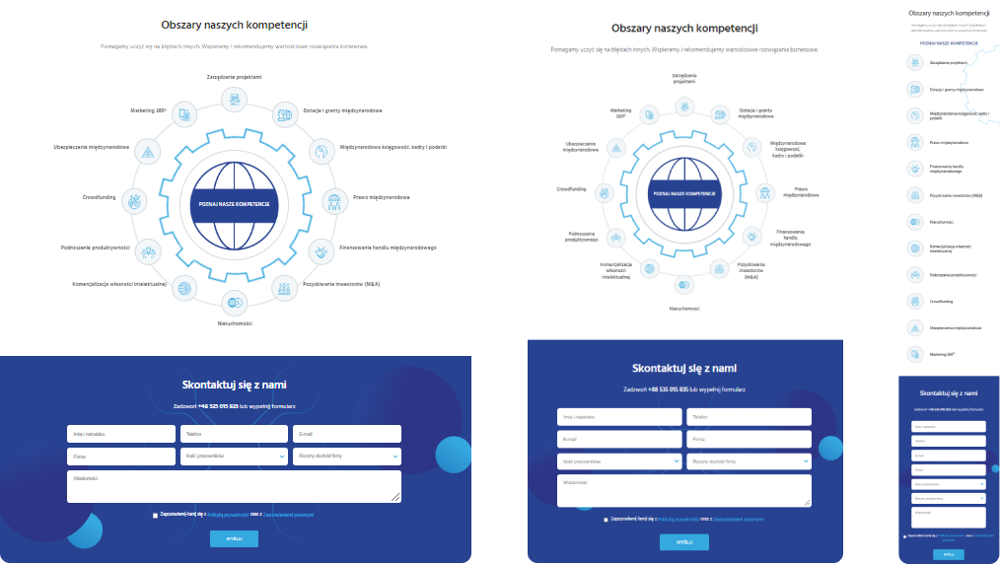

# Expandable Animated Gear

 

  **PSD-> HTML + CSS + JS (React.js)**

  
 Live preview of the project is available at [**this link**](https://annakrolikowska.github.io/task-gear/)

## :gear:  Installation

To run the project, you need to install all the necessary files:

    npm i

To start webpack and create a localhost, run the following command:

    npm start

 ## :hammer_and_pick: Technologies
 

## :envelope_with_arrow: Contact
Mail: krolikowska.ann@gmail.com

 [**LINKEDIN**](https://www.linkedin.com/in/krolikowska-ann/)
